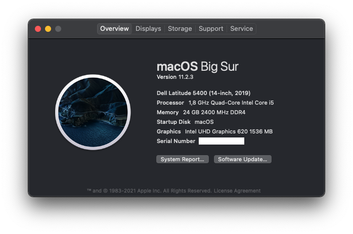

# Hackintosh for Dell Latitude 5400

*Based on OpenCore, of course.*

**WARNING: This repository now uses macOS Monterey 12, an early developer beta build of macOS! Use at your own risk! (Although everything should work as in Big Sur.) If you need info for Big Sur, feel free to look at an older commit.**

## Specification

| | |
|-|-|
|**CPU**|Intel i5-8265U CPU @ 1.60GHz (Whiskey Lake)|
|**RAM**|24GB DDR4 2400MHz|
|**IGPU**|Intel UHD 620|
|**SSD**|Western Digital Black NVMe 500GB|
|**ETH**|Intel I217-LM|
|**WLAN+BT**|BCM94360NG|
|**WWAN**|Dell DW5809e (EM7305, 4G)|
|**Audio**|Realtek ALC236|
|**Ports**|USB-C (PD+DP-AltMode), 3xUSB3.0, HDMI, microSD, Multi-Jack, DC|

## Not working

- MicroSD card reader
- TouchPad buttons
- TrackStick
- Dedicated brightness control keys (use Fn+S/Fn+B instead)
- Jack hotplug sometimes not working
- HDMI coldplug (hotplug is OK)
- *Hibernation (none of Hackintoshes can do that)*

## Working

- **Everything what is not in the Not working section :D**
- Bluetooth (4.0, LE, Handoff) [out-of-the-box, no kext needed]
- WLAN [no kext needed]
- Ethernet
- HDMI, DisplayPort Alt Mode (all with sound, but no volume adjustment)
- USB-C (I'm using it with a docking station all the time)
- WWAN (good speed, 4G, works fine, tho Apple kinda abandoned this feature)
- USB ports mapped, working after sleep
- TrackPad with gestures (visible as Magic Trackpad 2)
- Audio, with speaker and microphone support
- QE/CI
- Sleep

## Some random text

So I made this hackintosh basically just for fun, but it seems kinda stable, so I use it as my dialy driver. I've never had crashes with it.  
Regarding the not working stuff: the card reader is a PCI one, and only the USB ones are supported, there is no driver for it (currently). I don't need it anyway :) The Jack hotplug thing is more stable with every new AppleALC release but I don't use it because of two things: there is a jack port on my docking station and that works perfectly, or I just go with Bluetooth audio which works fine.  
The priority is the Trackpad buttons. That's a pain in the @ss. My trackpad is an I2C one, and I'm using it with the VoodooI2C kext which is pretty incompatible with VoodooPS2. So either I have a fully working Magic Trackpad 2 like Trackpad without buttons, or have a "dumb" Trackpad with buttons. I choose the first option. I usually use my Hackintosh with a Magic Mouse 2 anyways. But I would like to fix this sometime. In the meantime I have a mixed version of VoodooI2C and VoodooPS2 so I have keyboard (which is a good to have), and trackpad without buttons (update: now dragging works! (clicking still not, but I can live with that)).

Pull requests or suggestions are welcome! :)
